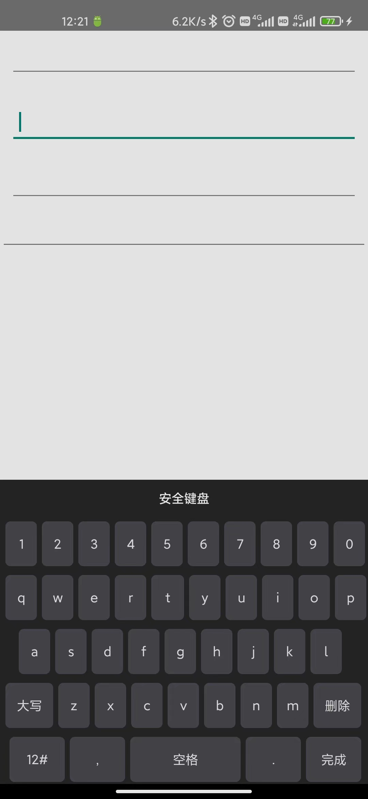

# A  custom view for customizing keyboard

## 1 Explanation

> modified from [EasyKeyBoardView](https://github.com/Jay-huangjie/EasyKeyBoardView)

related references

- [Android development: Custom keyboard](http://www.fampennings.nl/maarten/android/09keyboard/index.htm)
- [Android 自定义安全键盘](https://cloud.tencent.com/developer/article/1122031)
- [Android 自定义安全键盘](http://www.apkbus.com/blog-953354-77623.html)
- [ASCII 码对照表](http://ascii.911cha.com/)

## 2 Installation

- [ ] Upload to Maven Repository.
